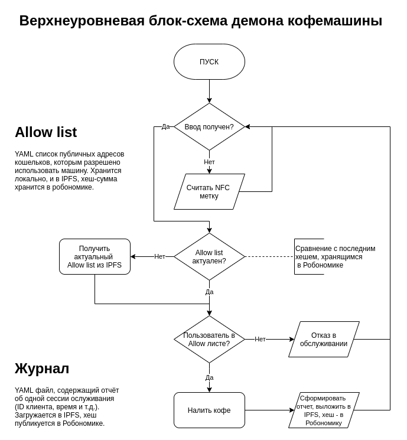

# Robonomics coffee

## О проекте

"Robonomics coffee" - это умная кофемашина, интегрированная в [сеть "Робономика"](https://robonomics.network/).
Данный проект призван на реальном примере продемонстрировать потенциал Робономики в сфере интернета вещей.

## Принцип работы

На корпусе кофемашины закреплен одноплатный ПК Raspberry Pi 4b, именно он является "мозгом" кофемашины.
Raspberry Pi подключается к кофемашине и управляет ей с помощью подачи команд на GPIO выводы, к нему также
подключен RFID/NFC сканер.

Чтобы налить кофе, пользователь должен приложить к сканеру NFC метку или телефон, на котором записан адрес 
его кошелька в сети Робономика. В памяти устройства имеется "список доверенных пользователей" (опционально).
Если использование списков настроено в файле конфигурации — пользователям, не находящимся в списке, будет 
отказано в обслуживании.

Подлинность и актуальность списков подтверждаются с помощью технологий IPFS и распределенного реестра 
Робономики, где хранится хеш-сумма подлинного списка доступа.

После авторизации пользователя, происходит обслуживание — пользователь получает одну чашку кофе.
Информация о произведённой сессии обслуживания записывается в журнал.

Принцип работы системы может быть представлен в виде абстрактной блок-схемы, приведенной ниже:

Стоит отметить, что, продемонстрированный в этом проекте принцип работы, не ограничивается взаимодействием с 
кофемашинами и может быть применён и в других устройствах интернета вещей и "умного дома".  

## Техническая реализация

### Использованное оборудование

- Одноплатный ПК Raspberry Pi 4b (2 GB)
- Кофемашина De’Longhi Magnifica ECAM 22.110
- RFID/NFC сканер PN532

### Использованные технологии

- Язык Python 3
- Robonomics
- IPFS
- Pinata
- Libnfc
- gpiozero
- Docker

## Участники проекта

- [Арсений Величко](https://github.com/arseniiarsenii) - код, документация, интеграция;
- [Павел Тарасов](https://github.com/PaTara43) - инженер;
- [Вадим Манаенко](https://github.com/Vourhey) - руководитель проекта.

## Лицензия

Код данного проекта опубликован под лицензией Apache 2.0.